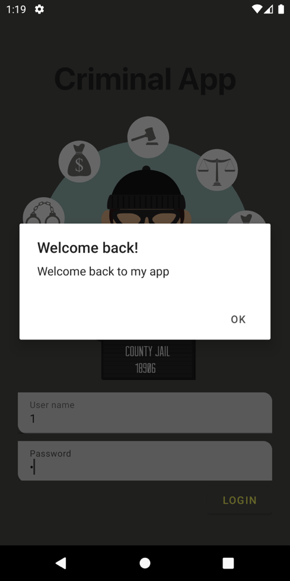

# CriminalIntent

**LƯƠNG VĂN Ý**

**XÂY DỰNG ỨNG DỤNG NGHI NGỜ TỘI PHẠM**

**Chuyên ngành : Công nghệ thông tin**

**Lớp : K12TT**

**Kon Tum, tháng 7 năm 2021\
**

MỤC LỤC

[1. TỔNG QUAN 5](#_Toc76898740)

[1.1 Tổng quan đề tài của báo cáo 5](#_Toc76898741)

[2. PHÂN TÍCH VÀ THIẾT KẾ 5](#_Toc76898742)

[2.1 Các tính năng 5](#_Toc76898743)

[2.2 Phân tích và thiết kế các tính năng 5](#_Toc76898744)

[a. Đăng nhập 5](#_Toc76898745)

[b. CRUD dữ liệu của các vi phạm 6](#_Toc76898746)

[3. DEMO ỨNG DỤNG 18](#_Toc76898747)

[3.1 Màn hình đăng nhập 18](#_Toc76898748)

[3.2 Màn hình chỉnh sửa 20](#_Toc76898749)

**\
**

DANH MỤC HÌNH

[Hình 1: Mã nguồn của Button login thực hiện tính năng đăng nhập
5](#_Toc76898397)

[Hình 2: Thiết kế của màn hình đăng nhập 6](#_Toc76898398)

[Hình 3: Mô hình được sử dụng trong ứng dụng 6](#_Toc76898399)

[Hình 4: Mã nguồn của lớp entity 7](#_Toc76898400)

[Hình 5: Mã nguồn cho lớp Dao 7](#_Toc76898401)

[Hình 6: Mã nguồn cho converter 8](#_Toc76898402)

[Hình 7: Đoạn mã đại diện cho cả cơ sở dữ liệu 8](#_Toc76898403)

[Hình 8: Đoạn mã để tạo viewModel cho danh sách các Crime
9](#_Toc76898404)

[Hình 9: Đoạn mã để tạo viewModel cho CrimeDetail 9](#_Toc76898405)

[Hình 10: Đoạn mã để xây dựng singleton 10](#_Toc76898406)

[Hình 11: Đoạn mã khởi tạo Repository 10](#_Toc76898407)

[Hình 12: Đoạn mã để cho hệ thống nhận biết lớp CrimeIntentApplication
10](#_Toc76898408)

[Hình 13: Đoạn mã quy định các API để thao tác đến SQLite
11](#_Toc76898409)

[Hình 14: Đoạn mã cho MainActivity 11](#_Toc76898410)

[Hình 15: Thiết kế màn hình MainActivity 12](#_Toc76898411)

[Hình 16: Đoạn mã cho lớp CrimeListFragment 13](#_Toc76898412)

[Hình 17: Đoạn mã để xây dựng CrimeListViewModel cho CrimeListFragment
13](#_Toc76898413)

[Hình 18: Đoạn mã xây dựng màn hình CrimeList cũng như là cài đặt
adapter cho Recycleview 14](#_Toc76898414)

[Hình 19: Adapter của RecyclerView tròn List Crime Fragment
14](#_Toc76898415)

[Hình 20: Đoạn mã xây dựng Holder cho CrimeList Adapter
15](#_Toc76898416)

[Hình 21: Thiết kế của màn hình List Crime 16](#_Toc76898417)

[Hình 22: Đoạn mã để xây dựng CrimeDetailViewModel cho CrimeFragment
16](#_Toc76898418)

[Hình 23: Code để cài đặt một số chức năng cho Crime details
17](#_Toc76898419)

[Hình 24: Màn hình thiết kế cho CrimeDetailFragment 18](#_Toc76898420)

[Hình 25: Giao diện đăng nhập 19](#_Toc76898421)

[Hình 26: Màn hình thông báo khi người dùng điền không đầy đủ thông tin
20](#_Toc76898422)

[Hình 27: Màn hình chào mừng người dùng quay lại 21](#_Toc76898423)

[Hình 28: Giao diện home của ứng dụng 22](#_Toc76898424)

[Hình 29: Giao diện tạo, chỉnh sửa các vi phạm 23](#_Toc76898425)

[Hình 30: Màn hình chọn ngày tháng 24](#_Toc76898426)

[Hình 31: Màn hình thể hiện chức năng chọn đối tượng tính nghi thông qua
các contact 25](#_Toc76898427)

[Hình 32: Màn hình gửi báo cáo 26](#_Toc76898428)

**\
**

1.  []{#_Toc76898740 .anchor}TỔNG QUAN

    1.  []{#_Toc76898741 .anchor}Tổng quan đề tài của báo cáo

Báo cáo với chủ đề là xây dựng ứng dụng để quản lý các lỗi vi phạm nhỏ
trong phạm vi là các văn phòng hay là các tập thể,...

2.  []{#_Toc76898742 .anchor}PHÂN TÍCH VÀ THIẾT KẾ

    1.  []{#_Toc76898743 .anchor}Các tính năng

Với đề tài này, ứng dụng sẽ gồm các tính năng cơ bản sau:

-   Đăng nhập

-   Lưu thông tin các tội phạm, các lỗi

-   Xoá, chỉnh sửa thông tin các lỗi vi phạm đó

    1.  []{#_Toc76898744 .anchor}Phân tích và thiết kế các tính năng

a.  []{#_Toc76898745 .anchor}Đăng nhập

Ứng dụng sử dụng singleton và các mảng để lưu trữ dữ liệu cho ứng dụng

Mã nguồn của chức năng:

{width="6.295138888888889in"
height="5.344444444444444in"}

[]{#_Toc76898397 .anchor}Hình 1: Mã nguồn của Button login thực hiện
tính năng đăng nhập

Thiết kế của màn hình đăng nhập:

{width="6.295138888888889in"
height="6.2375in"}

[]{#_Toc76898398 .anchor}Hình 2: Thiết kế của màn hình đăng nhập

b.  []{#_Toc76898746 .anchor}CRUD dữ liệu của các vi phạm

Ứng dụng sử dụng kiến trúc:

{width="4.597222222222222in"
height="2.6666666666666665in"}

[]{#_Toc76898399 .anchor}Hình 3: Mô hình được sử dụng trong ứng dụng

Trong đó, được chia thành 4 phần, gồm:

-   UI, controller là các phần ngoài cùng, tương tác trực tiếp cho người
    dùng, gồm các logic chính điều khiển các compont hiển thị lên màn
    hình

-   Phần hai gồm viewModel dùng để lưu trữ thông tin để hiển thị lên UI

-   Phần ba là SingleTon Repository để lưu trữ các Api dùng để giao tiếp
    với các dữ liệu ở phần RoomDatabase

-   Phần cuối là RoomDatabase dùng để quản lý, thực thi các truy vấn với
    SQLite database

**Mã nguồn của tính năng:**

{width="6.295138888888889in"
height="1.9152777777777779in"}

[]{#_Toc76898400 .anchor}Hình 4: Mã nguồn của lớp entity

Mã nguồn này có vai trò đại diện cho một bảng trong một cơ sở dữ liệu. Ở
hình trên đại diện cho Crime hay thông tin những vi phạm

{width="6.295138888888889in"
height="3.5430555555555556in"}

[]{#_Toc76898401 .anchor}Hình 5: Mã nguồn cho lớp Dao

Lớp Dao hay còn được gọi là Data access object, lớp này sẽ định dạng các
truy vấn đến cơ sở dữ liệu. Ở trên gồm 5 truy vấn chính.

Ngoài ra ở trên ứng dụng sử dụng LiveData có vai trò để giữ dữ liệu của
bạn luôn luôn thông báo đến các đối tượng được chỉ định khi dữ liệu có
sự thay đổi.

{width="6.295138888888889in"
height="4.673611111111111in"}

[]{#_Toc76898402 .anchor}Hình 6: Mã nguồn cho converter

Vì các dữ liệu được lưu trong Sqlite sẽ có cấu trúc khác với định dạng
dữ liệu được dùng trong ứng dụng, cho nên đoạn mã này có vai trò để
chuyển đổi các kiểu dữ liệu, giúp cho ứng dụng có thể sử dụng được các
dữ liệu được lưu trong SQLite.

{width="6.295138888888889in"
height="1.3888888888888888in"}

[]{#_Toc76898403 .anchor}Hình 7: Đoạn mã đại diện cho cả cơ sở dữ liệu

Không giống với các Entites ở hình trước mà tôi đã trình bày, đoạn mã
này có vai trò để đại diện cho cả database của ứng dụng

Đoạn mã cho phần 2 của kiến trúc:

{width="6.295138888888889in"
height="4.232638888888889in"}

[]{#_Toc76898404 .anchor}Hình 8: Đoạn mã để tạo viewModel cho danh sách
các Crime

Ở đoạn mã trên, ta sử dụng ViewModel để lưu trữ dữ liệu, cũng như định
nghĩa các hàm để phục vụ cho phần UI

{width="6.295138888888889in"
height="3.234027777777778in"}

[]{#_Toc76898405 .anchor}Hình 9: Đoạn mã để tạo viewModel cho
CrimeDetail

Tương tự, đoạn mã trên có vai trò cấu hình viewModel cho
CrimeDetailFragment

Mã nguồn cho phần 3: Repository

{width="6.295138888888889in"
height="2.435416666666667in"}

[]{#_Toc76898406 .anchor}Hình 10: Đoạn mã để xây dựng singleton

Đoạn mã trên được sử dụng để tạo nên SingleTons đại diện cho
CrimeRepository. Như chúng ta có thể thấy, class trên sẽ được khởi tạo
một lần duy nhất mỗi khi app chạy

{width="6.295138888888889in"
height="2.182638888888889in"}

[]{#_Toc76898407 .anchor}Hình 11: Đoạn mã khởi tạo Repository

Đoạn mã trên cấu hình lớp CrimeIntentApplication kế thừa lớp
Application(). Lớp này có sẽ có vòng đời khởi tạo tương đương với ứng
dụng. Tức là class này sẽ được khởi tạo trước khi một activity được khởi
tạo và sẽ được "dọn" sau khi không còn Activity nào của ứng dụng còn
hiển thị.

{width="6.295138888888889in"
height="2.0631944444444446in"}

[]{#_Toc76898408 .anchor}Hình 12: Đoạn mã để cho hệ thống nhận biết lớp
CrimeIntentApplication

Đoạn mã được viết trong AndroidManifest.xml, để cho hệ thống nhận thức
được CrimeIntentApplication và khởi chạy chúng. Nếu không có đoạn mã
này. CrimeIntentApplication sẽ không được khởi chạy

{width="6.295138888888889in"
height="4.409027777777778in"}

[]{#_Toc76898409 .anchor}Hình 13: Đoạn mã quy định các API để thao tác
đến SQLite

Đoạn mã sẽ định nghĩa các API dùng để thao tác truy vấn đến SQLite.
Thông qua các API này các phần ở trên như UI, viewModel sẽ không thể
biết các truy vấn sẽ được truy vấn như thế nào, mà để sử dụng dữ liệu,
chỉ đơn giản là gọi qua các hàm này.

Phần UI

{width="6.295138888888889in"
height="4.009027777777778in"}

[]{#_Toc76898410 .anchor}Hình 14: Đoạn mã cho MainActivity

MainActivity sử dụng FragmentLayout để hiển thị dữ liệu. Cho nên các
đoạn mã ở dưới có vai trò là xác định các Fragment để hiển thị trên
FragmentLayout.

Ngoài ra, lớp này còn kế thừa một Interface ở lớp CrimeListFragment có
vai trò như callbacks hay hàm gọi lại từ fragment đến activity. Thông
qua hàm callback này, Fragment có thể dễ dàng gọi lại hàm của activity
mà không vi phạm bất cứ nguyên tắc nào của android.

{width="6.295138888888889in"
height="6.085416666666666in"}

[]{#_Toc76898411 .anchor}Hình 15: Thiết kế màn hình MainActivity

Thiết kế gồm 2 phần, một phần là app bar và phần còn lại là
FragmentContainer có vai trò để "chứa" các Fragment

{width="6.295138888888889in"
height="3.595833333333333in"}

[]{#_Toc76898412 .anchor}Hình 16: Đoạn mã cho lớp CrimeListFragment

Ta có thể thấy interface Callbacks đã được kế thừa ở MainActivity tại
đây của CrimeListFragment. Như đã nói ở trước, callbacks sẽ có vai trò
để Fragment có thể gọi đến các hàm ở Activity

{width="6.295138888888889in"
height="0.9395833333333333in"}

[]{#_Toc76898413 .anchor}Hình 17: Đoạn mã để xây dựng CrimeListViewModel
cho CrimeListFragment

Đoạn mã trên để xây dựng ViewModel cho Fragment, viewmodel này sẽ được
khưởi tạo và có vòng đời tương tự như Fragment, và có khả năng lưu trữ
dữ liệu qua "quy trình chết" (Như khi mà ta thay đổi các configuration
của ứng dụng, ...) của Fragment.

{width="6.295138888888889in"
height="3.7930555555555556in"}

[]{#_Toc76898414 .anchor}Hình 18: Đoạn mã xây dựng màn hình CrimeList
cũng như là cài đặt adapter cho Recycleview

Đoạn mã trên có 3 chức năng, thứ nhất, đó chính là gán adapter,
layoutManager cho RycleView. Thứ 2 là cày đặt onClickListener cho button
addNewCrime. Thứ 3 đó là thực hiện observer pattern, mỗi khi mà dữ liệu
trong LiveData bị thay đổi, những hàm này sẽ được gọi.

{width="6.295138888888889in"
height="2.4034722222222222in"}

[]{#_Toc76898415 .anchor}Hình 19: Adapter của RecyclerView tròn List
Crime Fragment

Đoạn mã trên cài đặt adapter cho List Crime RecyclerView

{width="6.295138888888889in"
height="4.705555555555556in"}

[]{#_Toc76898416 .anchor}Hình 20: Đoạn mã xây dựng Holder cho CrimeList
Adapter

Đoạn mã trên sẽ xây dựng nên holder cho adapter. Và hàm bind sẽ được gọi
tại hàm onBindViewHolder ở adapter

{width="6.295138888888889in"
height="4.584027777777778in"}

[]{#_Toc76898417 .anchor}Hình 21: Thiết kế của màn hình List Crime

Trong đó bao gồm recyclerView và một FloattingActionButton

{width="6.295138888888889in"
height="3.509027777777778in"}

[]{#_Toc76898418 .anchor}Hình 22: Đoạn mã để xây dựng
CrimeDetailViewModel cho CrimeFragment

Tương tự như hình 23, đoạn mã có vai trò xây dựng CrimveDetailViewModel
để lưu trữ dữ liệu

{width="6.295138888888889in"
height="4.501388888888889in"}

[]{#_Toc76898419 .anchor}Hình 23: Code để cài đặt một số chức năng cho
Crime details

Đoạn code trên cài đặt một số chức năng cho Crime details, trong đó,
dateButton để mở DatePickerFragment và chọn ngày thàng, solvedCheckBox
để chỉ định checkbox, reportButton để thực hiện implicit intent trong
android, có vai trò là mở các ứng dụng có thể gửi trong điện thoại.
Tương tự với reportButton, suspectButton dùng để mở các ứng dụng có khả
năng lưu trữ contact.

{width="6.295138888888889in"
height="4.160416666666666in"}

[]{#_Toc76898420 .anchor}Hình 24: Màn hình thiết kế cho
CrimeDetailFragment

3.  []{#_Toc76898747 .anchor}DEMO ỨNG DỤNG

    1.  []{#_Toc76898748 .anchor}Màn hình đăng nhập

{width="2.2244094488188977in"
height="4.448818897637795in"}

[]{#_Toc76898421 .anchor}Hình 25: Giao diện đăng nhập

Thông báo khi người dùng điển đủ thông tin

{width="2.2244094488188977in"
height="4.448818897637795in"}

[]{#_Toc76898422 .anchor}Hình 26: Màn hình thông báo khi người dùng điền
không đầy đủ thông tin

{width="2.2244094488188977in"
height="4.448818897637795in"}

[]{#_Toc76898423 .anchor}Hình 27: Màn hình chào mừng người dùng quay lại

2.  []{#_Toc76898749 .anchor}Màn hình chỉnh sửa, tạo, xoá dữ liệu vi
    phạm

{width="2.2244094488188977in"
height="4.448818897637795in"}

[]{#_Toc76898424 .anchor}Hình 28: Giao diện home của ứng dụng

Giao diện tạo, cũng như chỉnh sửa các vi phạm

{width="2.144860017497813in"
height="4.289720034995626in"}

[]{#_Toc76898425 .anchor}Hình 29: Giao diện tạo, chỉnh sửa các vi phạm

{width="2.2244094488188977in"
height="4.448818897637795in"}

[]{#_Toc76898426 .anchor}Hình 30: Màn hình chọn ngày tháng

{width="2.2244094488188977in"
height="4.448818897637795in"}

[]{#_Toc76898427 .anchor}Hình 31: Màn hình thể hiện chức năng chọn đối
tượng tính nghi thông qua các contact

{width="2.2244094488188977in"
height="4.448818897637795in"}

[]{#_Toc76898428 .anchor}Hình 32: Màn hình gửi báo cáo
